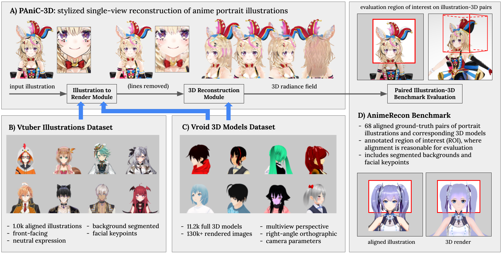

panic3d-anime-reconstruction
============================

<!--  -->

**PAniC-3D: Stylized Single-view 3D Reconstruction from Portraits of Anime Characters**  
Shuhong Chen,
Kevin Zhang,
Yichun Shi,
Heng Wang,
Yiheng Zhu,
Guoxian Song,
Sizhe An,
Janus Kristjansson,
Xiao Yang,
Matthias Zwicker  
CVPR2023  
\[[github](https://github.com/ShuhongChen/panic3d-anime-reconstruction)\]
[arxiv]
<!-- \[[arxiv](https://arxiv.org/abs/2111.12792)\] -->
<!-- \[[poster](./eccv2022_eisai_poster.pdf)\] -->
<!-- \[[video](https://youtu.be/jy4HKnG9YA0)\] -->
<!-- \[[colab](https://colab.research.google.com/github/ShuhongChen/eisai-anime-interpolator/blob/master/_notebooks/eisai_colab_demo.ipynb)\]   -->

*We propose PAniC-3D, a system to reconstruct stylized 3D character heads directly from illustrated (p)ortraits of (ani)me (c)haracters.  Our anime-style domain poses unique challenges to single-view reconstruction; compared to natural images of human heads, character portrait illustrations have hair and accessories with more complex and diverse geometry, and are shaded with non-photorealistic contour lines.  In addition, there is a lack of both 3D model and portrait illustration data suitable to train and evaluate this ambiguous stylized reconstruction task.  Facing these challenges, our proposed PAniC-3D architecture crosses the illustration-to-3D domain gap with a line-filling model, and represents sophisticated geometries with a volumetric radiance field.  We train our system with two large new datasets (11.2k Vroid 3D models, 1k Vtuber portrait illustrations), and evaluate on a novel AnimeRecon benchmark of illustration-to-3D pairs.  PAniC-3D significantly outperforms baseline methods, and provides data to establish the task of stylized reconstruction from portrait illustrations.*

## download

There are several repos related to this work, roughly laid out according to the above schematic; please follow instructions in each to download

* A) [panic3d-anime-reconstruction](https://github.com/ShuhongChen/panic3d-anime-reconstruction) (this repo): reconstruction models
* B) [vtubers-dataset](https://github.com/ShuhongChen/vtubers-dataset): download 2D data
* C) [vroid-dataset](https://github.com/ShuhongChen/vroid-dataset): download 3D data
* D) [animerecon-benchmark](https://github.com/ShuhongChen/animerecon-benchmark): download 2D-3D paired evaluation dataset
* C+D) [vroid_renderer](https://github.com/ShuhongChen/vroid_renderer): convert and render 3D models

For this repo, download the pretrained models from [this drive folder](https://drive.google.com/drive/folders/14p47v_dO7CULOonmeZDigMyLUQXYcm78?usp=sharing), and place in `./`

<!-- Related downloads for all the above repos can be found in this drive folder: [cvpr2023_panic3d_anime_reconstruction_release](https://drive.google.com/drive/folders/1Zpt9x_OlGALi-o-TdvBPzUPcvTc7zpuV?usp=sharing) -->

## setup

Make a copy of `./_env/machine_config.bashrc.template` to `./_env/machine_config.bashrc`, and set `$PROJECT_DN` to the absolute path of this repository folder.  The other variables are optional.

This project requires docker with a GPU.  Run these lines from the project directory to pull the image and enter a container; note these are bash scripts inside the `./make` folder, not `make` commands.  Alternatively, you can build the docker image yourself.

    make/docker_pull
    make/shell_docker
    # OR
    make/docker_build
    make/shell_docker

## preprocessing

After the raw data is downloaded, run these lines to preprocess for reconstruction evaluation/training:

## evaluation

Run this line to reproduce the best-result metrics from our paper; the output should match up to precision differences (tested on RTX 3080 Ti).

    python3 -m _scripts.generate \
    && python3 -m _scripts.measure

    #  subset metric  score      
    # ===========================
    #  all    lpips   3.4943E-02 
    #  all    chamfer 4.3505

## training

Run this line to train on RRLD-extracted data:

    python3 -m _train.frame_interpolation.train \
        ./temp/rrld_demo_output \
        ./temp/training_demo_output

## citing

If you use our repo, please cite our work:

    @inproceedings{chen2023panic3d,
        title={Transfer Learning for Pose Estimation of Illustrated Characters},
        author={Chen, Shuhong and Zhang, Kevin and Shi, Yichun and Wang, Heng and Zhu, Yiheng and Song, Guoxian and An, Sizhe and Kristjansson, Janus and Yang, Xiao and Matthias Zwicker},
        booktitle={Proceedings of the IEEE/CVF Conference on Computer Vision and Pattern Recognition (CVPR)},
        year={2023}
    }

This repo is heavily based off the [NVlabs/eg3d](https://github.com/NVlabs/eg3d) repo; thanks to the EG3D authors for releasing their code

