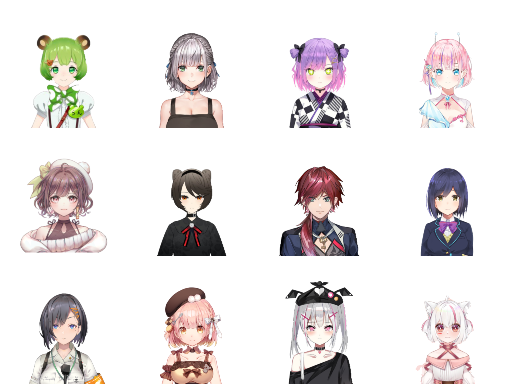

panic3d-anime-reconstruction
============================

**PAniC-3D: Stylized Single-view 3D Reconstruction from Portraits of Anime Characters**  
Shuhong Chen,
Kevin Zhang,
Yichun Shi,
Heng Wang,
Yiheng Zhu,
Guoxian Song,
Sizhe An,
Janus Kristjansson,
Xiao Yang,
Matthias Zwicker  
CVPR2023  
\[[arxiv](https://arxiv.org/abs/2303.14587)\]
\[[github](https://github.com/ShuhongChen/panic3d-anime-reconstruction)\]
\[[art attrib](./supplementary/art_attributions.txt)\]
<!-- \[[poster](./eccv2022_eisai_poster.pdf)\] -->
<!-- \[[video](https://youtu.be/jy4HKnG9YA0)\] -->
<!-- \[[colab](https://colab.research.google.com/github/ShuhongChen/eisai-anime-interpolator/blob/master/_notebooks/eisai_colab_demo.ipynb)\]   -->

*We propose PAniC-3D, a system to reconstruct stylized 3D character heads directly from illustrated (p)ortraits of (ani)me (c)haracters.  Our anime-style domain poses unique challenges to single-view reconstruction; compared to natural images of human heads, character portrait illustrations have hair and accessories with more complex and diverse geometry, and are shaded with non-photorealistic contour lines.  In addition, there is a lack of both 3D model and portrait illustration data suitable to train and evaluate this ambiguous stylized reconstruction task.  Facing these challenges, our proposed PAniC-3D architecture crosses the illustration-to-3D domain gap with a line-filling model, and represents sophisticated geometries with a volumetric radiance field.  We train our system with two large new datasets (11.2k Vroid 3D models, 1k Vtuber portrait illustrations), and evaluate on a novel AnimeRecon benchmark of illustration-to-3D pairs.  PAniC-3D significantly outperforms baseline methods, and provides data to establish the task of stylized reconstruction from portrait illustrations.*

## talking head demo

inputs            |  outputs
:-------------------------:|:-------------------------:
  |  

A talking head demo is available in the project's [drive folder](https://drive.google.com/drive/folders/1Zpt9x_OlGALi-o-TdvBPzUPcvTc7zpuV?usp=share_link).  We extend PAniC-3D to provide a 3D talking head from a single portrait illustration.  The mesh is extracted with normals through marching cubes, and we manually place two bones with linear blend skinning (this maybe automated with [RigNet](https://zhan-xu.github.io/rig-net/), etc.).  Instead of making texture maps, we render the positions and normals of intersections, which are then used as rays to query our radiance field.  In order to perform expression changes, we incorporate [talking-head-anime-2](https://github.com/pkhungurn/talking-head-anime-2-demo) to change the texture.

## download

Download the `panic_data_models_merged.zip` from the project's [drive folder](https://drive.google.com/drive/folders/1Zpt9x_OlGALi-o-TdvBPzUPcvTc7zpuV?usp=share_link), and merge it with this repo's file structure.

There are several repos related to this work, roughly laid out according to the above schematic; please follow instructions in each to download

* A) [panic3d-anime-reconstruction](https://github.com/ShuhongChen/panic3d-anime-reconstruction) (this repo): reconstruction models
* B) [vtubers-dataset](https://github.com/ShuhongChen/vtubers-dataset): download 2D data
* C) [vroid-dataset](https://github.com/ShuhongChen/vroid-dataset): download 3D data
* D) [animerecon-benchmark](https://github.com/ShuhongChen/animerecon-benchmark): download 2D-3D paired evaluation dataset
* C+D) [vroid_renderer](https://github.com/ShuhongChen/vroid_renderer): convert and render 3D models

All the repos add to `./_data/lustrous` and share its file structure; we recommend making a folder on a large drive, then symlinking it as `./_data/lustrous` in each repo

## setup

Make a copy of `./_env/machine_config.bashrc.template` to `./_env/machine_config.bashrc`, and set `$PROJECT_DN` to the absolute path of this repository folder.  The other variables are optional.

This project requires docker with a GPU.  Run these lines from the project directory to pull the image and enter a container; note these are bash scripts inside the `./make` folder, not `make` commands.  Alternatively, you can build the docker image yourself.

    make/docker_pull
    make/shell_docker
    # OR
    make/docker_build
    make/shell_docker

## evaluation

Run this line to reproduce the best-result metrics from our paper.  There might be minor hardware variations and randomness in rendering; below are results from two different machines.

    python3 -m _scripts.eval.generate && python3 -m _scripts.eval.measure

    #      RTX 3080 Ti             GTX 1080 Ti
    #  subset metric  value    subset metric  value 
    # ======================  ======================
    #  front  clip   94.667    front  clip   94.659 
    #  front  lpips  19.373    front  lpips  19.367 
    #  front  psnr   16.914    front  psnr   16.910 
    #  back   clip   85.046    back   clip   85.117 
    #  back   lpips  30.017    back   lpips  30.012 
    #  back   psnr   15.508    back   psnr   15.509 
    #  360    clip   84.606    360    clip   84.629 
    #  360    lpips  25.252    360    lpips  25.250 
    #  360    psnr   15.977    360    psnr   15.976 
    #  geom   cd      1.329    geom   cd      1.328 
    #  geom   f1@5   37.725    geom   f1@5   38.051 
    #  geom   f1@10  65.498    geom   f1@10  65.813 

## training

The training script is at `./_train/eg3dc/runs/ecrutileE_eclustrousC_n120/ecrutileE_eclustrousC_n120.sh`, which contains the command and hyperparameters used for our best model

## citing

If you use our repo, please cite our work:

    @inproceedings{chen2023panic3d,
        title={PAniC-3D: Stylized Single-view 3D Reconstruction from Portraits of Anime Characters},
        author={Chen, Shuhong and Zhang, Kevin and Shi, Yichun and Wang, Heng and Zhu, Yiheng and Song, Guoxian and An, Sizhe and Kristjansson, Janus and Yang, Xiao and Matthias Zwicker},
        booktitle={Proceedings of the IEEE/CVF Conference on Computer Vision and Pattern Recognition (CVPR)},
        year={2023}
    }

This repo is heavily based off the [NVlabs/eg3d](https://github.com/NVlabs/eg3d) repo; thanks to the EG3D authors for releasing their code

